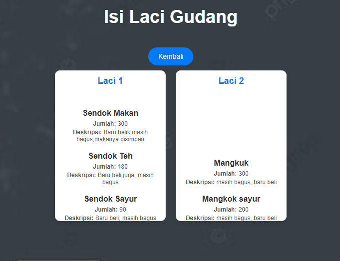
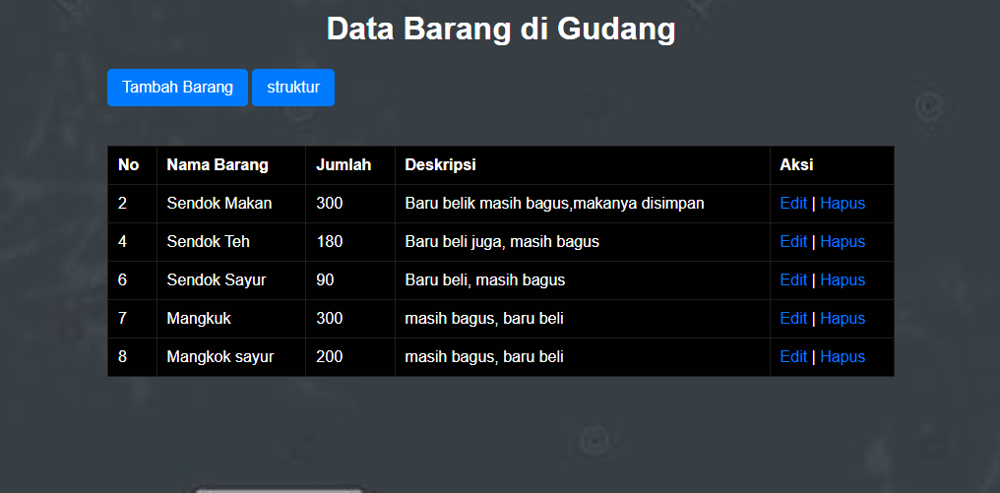
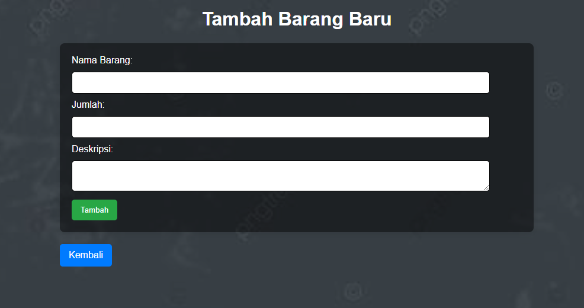

# Proyek Aplikasi Manajemen Gudang

## Deskripsi
Proyek ini adalah aplikasi sederhana untuk manajemen gudang menggunakan PHP dan SQLite. Aplikasi ini memungkinkan pengguna untuk menambahkan item ke dalam database dan menampilkan daftar item yang sudah disimpan.

## Struktur Proyek
Berikut adalah struktur direktori dan file dalam proyek ini:

## File Deskripsi

### `struktur.php`
File ini bertanggung jawab untuk membuat koneksi ke database SQLite dan membuat tabel `items` jika belum ada. Tabel ini menyimpan informasi tentang item yang ditambahkan ke dalam gudang.
 `screenshoot/struktur.png`

### `index.php`
File ini adalah halaman utama aplikasi. Di sini, pengguna dapat melihat daftar item yang telah ditambahkan ke database. Halaman ini akan mengambil data dari tabel `items` dan menampilkannya dalam format tabel.
 `screenshoot/index.png`

### `add.php`
File ini berisi formulir untuk menambah item baru ke dalam database. Pengguna dapat memasukkan nama, jumlah, dan deskripsi item. Setelah formulir disubmit, data akan diproses dan disimpan ke dalam database.
 `screenshoot/add.png`

